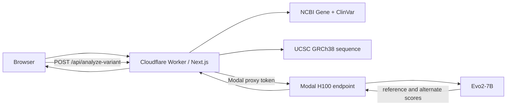

# GeneLM Evo2

GeneLM Evo2 is a full-stack research prototype for exploring human genes and
scoring single-nucleotide variants (SNVs) with the pretrained Evo2-7B DNA
language model. It joins NCBI Gene and ClinVar metadata with UCSC GRCh38
reference sequence, then compares the likelihood of matched reference and
alternate 8,192 bp contexts.

> **Research use only.** The Evo2 output is a model likelihood difference. It
> is not a pathogenicity classification, calibrated probability, diagnosis, or
> medical recommendation.

## Current status

- The Next.js application is configured for Cloudflare Workers through the
  supported OpenNext adapter.
- Gene search, direct gene URLs, sequence browsing, ClinVar lookup, forward/
  reverse-strand SNV normalization, and click-a-base analysis are implemented.
- The Modal H100 service definition is implemented but has **not yet been
  deployed or connected** in this repository's current state.
- No benchmark metric is claimed. A GPU benchmark must persist its complete
  inputs, outputs, model revision, and evaluation protocol before an AUROC is
  added to this README or a résumé.

## What is technically interesting

- Explicit coordinate contract: the UI uses 1-based inclusive genomic
  positions, UCSC receives 0-based half-open intervals, and the model always
  receives exactly 8,192 bases.
- Strand-safe ClinVar handling: transcript alleles are checked against the
  fetched GRCh38 reference base and complemented when the record is on the
  reverse strand.
- Honest model contract: the API returns `alternate_score - reference_score`
  and deliberately avoids unsupported “likely pathogenic,” “likely benign,”
  or confidence-percentage labels.
- Protected GPU boundary: browsers call a same-origin Cloudflare Route
  Handler. Modal URL and proxy credentials are runtime secrets, Modal requires
  proxy authentication, and Cloudflare limits anonymous analysis requests.
- Reproducible backend image: CUDA, PyTorch, FlashAttention, and the Evo2 source
  revision are pinned in the Modal image definition.

## Architecture



The browser never receives the Modal endpoint URL, token ID, or token secret.

## Supported analysis contract

| Dimension | Supported |
| --- | --- |
| Species | Human |
| Assembly | GRCh38 / UCSC `hg38` |
| Variant | One genomic SNV (`A`, `C`, `G`, or `T`) |
| Coordinates | 1-based inclusive at the public API boundary |
| Model | `evo2_7b` |
| Context | 8,192 bp |
| Output | Reference score, alternate score, and alt-minus-ref delta |
| Intended use | Research and software demonstration only |

## Repository layout

```text
GeneLM-Evo2/
├── genelm-frontend/
│   ├── src/app/api/analyze-variant/route.ts  # protected Cloudflare proxy
│   ├── src/components/                       # gene and variant UI
│   ├── src/utils/                            # typed NCBI/UCSC contracts
│   ├── open-next.config.ts
│   └── wrangler.jsonc
├── genelm-backend/
│   ├── main.py                               # Modal H100 endpoint
│   ├── variant_core.py                       # pure coordinate/scoring logic
│   └── tests/
└── .github/workflows/ci.yml
```

## Local development

### Frontend

Requires Node.js 22 and npm.

```bash
cd genelm-frontend
npm ci
npm run dev
```

Gene and sequence exploration works without Modal. Variant scoring returns a
clear `503` until the three server-side Modal variables are configured.

To test with an already deployed Modal service:

```bash
cp .env.example .env.local
# Replace the placeholder values in .env.local.
npm run dev
```

### Backend tests

```bash
cd genelm-backend
python3 -m venv .venv
source .venv/bin/activate
python -m pip install -r requirements-dev.txt
pytest -q
```

These tests exercise coordinate conversion, chromosome validation, reference
allele checking, exact context length, mutation, and score direction. They do
not download Evo2 weights or assert GPU performance.

## Quality gates

```bash
cd genelm-frontend
npm run check
npm run build
npm run build:cloudflare
```

CI runs frontend formatting, lint, strict TypeScript, unit tests, the production
build, and backend tests on every push and pull request.

## API

The public browser contract is the same-origin route:

```http
POST /api/analyze-variant
Content-Type: application/json
```

```json
{
  "variant_pos": 43119628,
  "alt_allele": "G",
  "expected_ref": "A",
  "genome": "hg38",
  "chromosome": "chr17"
}
```

The protected Modal response is validated before the Worker returns it:

```json
{
  "position": 43119628,
  "chromosome": "chr17",
  "genome": "hg38",
  "model": "evo2_7b",
  "context_length": 8192,
  "reference": "A",
  "alternate": "G",
  "reference_score": -1234.5,
  "alternate_score": -1234.7,
  "delta_likelihood": -0.2,
  "interpretation": "delta_likelihood = alternate_score - reference_score; this research score is not a clinical classification or probability"
}
```

The numeric values above illustrate the schema only; they are not measured
results from this repository.

## Connect Modal to Cloudflare

### 1. Deploy the authenticated Modal service

```bash
cd genelm-backend
python3 -m venv .venv
source .venv/bin/activate
python -m pip install -r requirements.txt
modal setup
modal deploy main.py
```

The first build compiles GPU dependencies and can take time. Record the URL
printed for `Evo2Model.analyze_single_variant`. The function is protected with
`requires_proxy_auth=True` and scales to at most one H100 container by default
to constrain demo cost.

### 2. Create a Modal proxy token

In the Modal dashboard, open **Settings → Proxy Tokens**, choose **New Token**,
and save the one-time token ID (`wk-...`) and secret (`ws-...`). If Modal RBAC
is enabled, allow the token in the environment where the app was deployed.

### 3. Store all three values as Cloudflare Worker secrets

```bash
cd genelm-frontend
npx wrangler secret put MODAL_ANALYZE_URL
npx wrangler secret put MODAL_PROXY_KEY
npx wrangler secret put MODAL_PROXY_SECRET
```

Paste the endpoint URL, `wk-...`, and `ws-...` when prompted. Do not use a
`NEXT_PUBLIC_` variable for any of them.

### 4. Deploy the Worker

```bash
npm run deploy
```

The deploy script retains dashboard-managed runtime variables and secrets.
`wrangler.jsonc` also provides a Cloudflare Rate Limiting binding for three
analysis calls per anonymous client per minute. For a public launch, add
Cloudflare Turnstile or user authentication and a WAF rate-limit rule as a
second cost-control layer.

### 5. Smoke test

Open a gene such as BRCA1, click a displayed base, choose a different allele,
and submit. Confirm that:

1. the browser only calls `/api/analyze-variant`;
2. the response reports an 8,192 bp context and `evo2_7b`;
3. an invalid reference allele is rejected;
4. a fourth request within one minute returns HTTP 429;
5. Modal scales back to zero after the configured idle window.

## Résumé wording

Safe wording before Modal GPU verification:

> Built a full-stack human GRCh38 variant-analysis prototype using Next.js,
> TypeScript, Cloudflare Workers, NCBI/ClinVar/UCSC APIs, and a protected Modal
> H100 service definition for pretrained Evo2-7B inference.

> Implemented strand-aware SNV normalization and reference-versus-alternate
> likelihood scoring over fixed 8,192 bp contexts, with strict coordinate/data
> validation, rate limiting, unit tests, and CI.

After deployment, replace “service definition” with “inference service” only
after a real end-to-end smoke test. Add latency, throughput, cost, or AUROC only
from persisted, reproducible run artifacts.

## Attribution

- [Evo2](https://github.com/ArcInstitute/evo2) by Arc Institute
- [UCSC Genome Browser API](https://api.genome.ucsc.edu/)
- [NCBI Gene](https://www.ncbi.nlm.nih.gov/gene/) and
  [ClinVar](https://www.ncbi.nlm.nih.gov/clinvar/)
- [Cloudflare Workers](https://developers.cloudflare.com/workers/) and
  [Modal](https://modal.com/)

## License

MIT. See [LICENSE](LICENSE).
