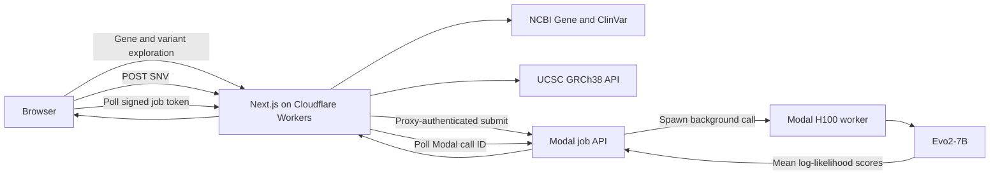

# GeneLM Evo2

**Full-stack genomic variant exploration and Evo2-7B inference on GRCh38**

[](https://jarvis-ai.work/)
[](https://doi.org/10.1038/s41586-026-10176-5)
[](https://github.com/ArcInstitute/evo2)
[](LICENSE)

**Project website / 项目网址:** [https://jarvis-ai.work/](https://jarvis-ai.work/)

[English](#english) · [中文](#中文)

> **Research use only.** GeneLM Evo2 reports DNA language-model likelihood
> differences. It does not provide a clinical diagnosis, pathogenicity
> classification, calibrated probability, or medical recommendation.

---

## English

### Overview

GeneLM Evo2 is a personal full-stack research and engineering project for
exploring human genes and scoring single-nucleotide variants (SNVs) with the
pretrained **Evo2-7B** DNA foundation model.

The application connects four layers into one reproducible workflow:

1. **NCBI Gene** search and gene metadata;
2. **ClinVar** variant records and clinical annotations;
3. **UCSC GRCh38** reference-sequence retrieval with explicit coordinate
   conversion;
4. authenticated **Evo2-7B inference on Modal H100**, proxied through a
   Cloudflare Worker.

The live interface is available at
[jarvis-ai.work](https://jarvis-ai.work/). The current Cloudflare Worker build
is also reachable at
[genelm-evo2.jarviszhang-ai.workers.dev](https://genelm-evo2.jarviszhang-ai.workers.dev/).

### Model and Nature publication

Evo 2 is an open biological foundation-model family introduced by Brixi et al.
in the Nature article **“Genome modelling and design across all domains of life
with Evo 2”**, published online on 4 March 2026.

The paper describes Evo 2 models trained on genomic sequences spanning all
domains of life, with applications in variant-effect prediction,
interpretability, and biological sequence generation. This repository **does
not claim authorship of Evo 2 or reproduction of the Nature benchmarks**. It
integrates the released pretrained `evo2_7b` checkpoint into a secure,
testable, end-to-end genomic analysis product.

- Nature paper: [doi:10.1038/s41586-026-10176-5](https://doi.org/10.1038/s41586-026-10176-5)
- Official model repository: [ArcInstitute/evo2](https://github.com/ArcInstitute/evo2)
- Pinned source revision: `27f32da50d08501b5cb12e7a55f663e2ec794e0f`

### What the application does

- Searches human genes by symbol or name and supports direct gene URLs.
- Displays NCBI gene metadata, genomic coordinates, and external references.
- Loads up to 10,000 bp of UCSC `hg38` sequence in an interactive viewer.
- Retrieves ClinVar records within the selected GRCh38 gene interval.
- Restricts Evo2 scoring to resolvable SNVs and clearly labels unsupported
  insertions, deletions, and other indels.
- Normalizes transcript alleles to the GRCh38 forward strand, including
  reverse-strand complementation.
- Builds matched 8,192 bp reference and alternate contexts around the variant.
- Returns mean per-token log-likelihoods and
  `alternate_score - reference_score`.
- Keeps all outputs explicitly separate from ClinVar clinical significance.

### Engineering highlights

- **Explicit coordinate contract:** the public API accepts 1-based inclusive
  positions; UCSC receives 0-based half-open intervals; Evo2 always receives
  exactly 8,192 bases.
- **Reference validation:** a request is rejected if its expected reference
  allele does not match the fetched GRCh38 base.
- **Asynchronous GPU jobs:** Cloudflare submits a short authenticated request,
  Modal runs Evo2 in the background, and the browser polls with a signed opaque
  job token. This supports scale-to-zero H100 inference without holding one
  long HTTP request open during cold starts.
- **Protected inference boundary:** Modal URL and proxy credentials remain
  server-side Cloudflare secrets and never reach the browser.
- **Cost controls:** anonymous analysis submissions are rate-limited and the
  Modal class scales to at most one H100 container.
- **Reproducible model image:** CUDA, PyTorch, Transformer Engine,
  FlashAttention, Evo2 dependencies, and the Evo2 Git revision are pinned.
- **Honest scientific presentation:** no unsupported AUROC, pathogenicity
  accuracy, throughput, or clinical-performance claim is made.

### Architecture



The browser never receives the Modal endpoint, proxy token ID, proxy secret,
or raw Modal function-call ID.

### Supported scientific contract

| Dimension          | Current support                                                  |
| ------------------ | ---------------------------------------------------------------- |
| Species            | Human                                                            |
| Reference assembly | GRCh38 / UCSC `hg38`                                             |
| Variant type       | One genomic SNV: `A`, `C`, `G`, or `T`                           |
| Public coordinates | 1-based inclusive                                                |
| Model              | Pretrained `evo2_7b`                                             |
| Scoring context    | 8,192 bp                                                         |
| Output             | Mean reference/alternate log-likelihoods and alt-minus-ref delta |
| Intended use       | Research and software-engineering demonstration only             |

### Technology stack

| Layer           | Technologies                                             |
| --------------- | -------------------------------------------------------- |
| Frontend        | Next.js 16, React 19, TypeScript, Tailwind CSS, Radix UI |
| Data contracts  | Zod, Pydantic v2                                         |
| Genomic data    | NCBI Gene, ClinVar, UCSC Genome Browser API              |
| Model serving   | Modal, NVIDIA H100, CUDA 12.8, PyTorch 2.7, Evo2-7B      |
| Edge deployment | Cloudflare Workers, OpenNext, Wrangler, Rate Limiting    |
| Verification    | Vitest, ESLint, TypeScript, Pytest, GitHub Actions       |

### Repository layout

```text
GeneLM-Evo2/
├── genelm-frontend/
│   ├── src/app/api/analyze-variant/route.ts  # Cloudflare inference proxy
│   ├── src/components/                       # gene, sequence, and SNV UI
│   ├── src/utils/                            # typed external API contracts
│   ├── open-next.config.ts
│   └── wrangler.jsonc
├── genelm-backend/
│   ├── main.py                               # Modal job API + H100 worker
│   ├── variant_core.py                       # pure coordinate/scoring logic
│   └── tests/
├── .github/workflows/ci.yml
└── README.md
```

### Local development

#### Frontend

Requires Node.js 22 and npm.

```bash
cd genelm-frontend
npm ci
npm run dev
```

Gene search, sequence exploration, and ClinVar browsing work without Modal.
For local inference, copy the variable names from `.dev.vars.example` into an
ignored `.env.local` file and provide the deployed Modal endpoint and proxy
token.

#### Backend tests on this Mac

The local development environment is the Conda environment `Biotech_ev2`:

```bash
cd genelm-backend
conda activate Biotech_ev2
env PYTHONNOUSERSITE=1 python -m pip install -r requirements-dev.txt
env PYTHONNOUSERSITE=1 python -m pytest -q
```

The unit suite validates coordinate conversion, chromosome normalization,
reference checking, exact context length, mutation direction, mean score
reduction, and asynchronous job request validation. It does not download model
weights or claim local GPU performance.

### Quality gates

```bash
cd genelm-frontend
npm run check
npm run build:cloudflare

cd ../genelm-backend
env PYTHONNOUSERSITE=1 conda run -n Biotech_ev2 python -m pytest -q
env PYTHONNOUSERSITE=1 conda run -n Biotech_ev2 python -m py_compile main.py variant_core.py
```

The verified local result for the current revision is **10 frontend tests and
8 backend tests passing**, plus a successful Cloudflare production build and a
real Modal H100 inference smoke test.

### Deployment

Deploy the authenticated Modal service:

```bash
cd genelm-backend
conda activate Biotech_ev2
env PYTHONNOUSERSITE=1 python -m pip install -r requirements.txt
modal setup
modal deploy main.py
```

Store the endpoint and Modal proxy token as Cloudflare Worker secrets:

```bash
cd ../genelm-frontend
npx wrangler secret put MODAL_ANALYZE_URL
npx wrangler secret put MODAL_PROXY_KEY
npx wrangler secret put MODAL_PROXY_SECRET
npm run deploy
```

Never expose these values through `NEXT_PUBLIC_*` variables or commit them to
Git.

### Verified inference example

For the GRCh38 SNV `chr17:43119628 T>G`, the deployed Evo2-7B H100 smoke test
returned:

```json
{
  "model": "evo2_7b",
  "context_length": 8192,
  "reference": "T",
  "alternate": "G",
  "reference_score": -0.8358864784240723,
  "alternate_score": -0.8358675837516785,
  "delta_likelihood": 0.000018894672393798828
}
```

This is a model likelihood comparison, not a clinical interpretation.

### Resume-ready description

> Built and deployed a full-stack GRCh38 variant-analysis platform integrating
> NCBI Gene, ClinVar, UCSC reference sequences, and pretrained Evo2-7B inference
> on Modal H100 GPUs through an authenticated Cloudflare Worker.

> Implemented strand-aware SNV normalization, fixed 8,192 bp
> reference/alternate scoring, signed asynchronous GPU jobs, schema validation,
> rate limiting, automated tests, CI, and scale-to-zero deployment.

### Limitations

- Only human GRCh38 SNVs are currently scored.
- The system is not a clinical decision-support tool.
- ClinVar significance labels come from ClinVar, not Evo2.
- No paper benchmark, AUROC, latency, throughput, or cost result is claimed as
  a result of this repository without a persisted evaluation protocol.
- The project integrates a pretrained model; it does not train Evo2 from
  scratch.

---

## 中文

### 项目简介

GeneLM Evo2 是一个个人全栈科研工程项目，用于检索人类基因、浏览 GRCh38
参考序列与 ClinVar 变异，并调用预训练 **Evo2-7B** DNA 基础模型对单核苷酸
变异（SNV）进行参考序列与突变序列的似然比较。

项目将以下四层能力整合为一条可复现的分析链路：

1. 使用 **NCBI Gene** 检索基因与读取元数据；
2. 使用 **ClinVar** 获取变异记录与临床注释；
3. 使用 **UCSC GRCh38 API** 获取参考序列并进行严格坐标转换；
4. 通过 Cloudflare Worker 安全代理，在 **Modal H100** 上运行 Evo2-7B
   推理。

在线项目地址：[https://jarvis-ai.work/](https://jarvis-ai.work/)

当前 Cloudflare Worker：
[genelm-evo2.jarviszhang-ai.workers.dev](https://genelm-evo2.jarviszhang-ai.workers.dev/)

### Evo 2 与 Nature 论文

Evo 2 是 Brixi 等人在 Nature 论文 **《Genome modelling and design across
all domains of life with Evo 2》** 中发布的开放生物基础模型，论文于 2026
年 3 月 4 日在线发表。

论文展示了 Evo 2 在跨生命域基因组建模、遗传变异影响预测、模型可解释性和
生物序列生成方面的能力。本仓库**不声称参与 Evo 2 模型研发，也不声称复现了
Nature 论文中的完整基准结果**；本项目的工作是把官方发布的预训练
`evo2_7b` 模型工程化为一个安全、可测试、可在线访问的基因变异分析系统。

- Nature 论文：[doi:10.1038/s41586-026-10176-5](https://doi.org/10.1038/s41586-026-10176-5)
- Evo 2 官方仓库：[ArcInstitute/evo2](https://github.com/ArcInstitute/evo2)
- 本项目固定的源码版本：`27f32da50d08501b5cb12e7a55f663e2ec794e0f`

### 核心功能

- 按基因符号或名称检索人类基因，并支持基因详情直达链接。
- 展示 NCBI 基因信息、染色体位置、基因类型和外部数据库链接。
- 交互式浏览最多 10,000 bp 的 UCSC `hg38` 参考序列。
- 获取选定基因区间内的 ClinVar 变异记录。
- 仅允许可解析的 SNV 进入 Evo2 评分，并明确标记不支持的插入、缺失和
  其他 indel。
- 将转录本等位基因统一到 GRCh38 正向链，包括反向链互补转换。
- 围绕变异构造严格匹配的 8,192 bp 参考与突变上下文。
- 输出 reference/alternate 的逐 token 平均对数似然，以及
  `alternate_score - reference_score`。
- 将 Evo2 模型分数与 ClinVar 临床意义标签严格分开显示。

### 工程亮点

- **严格坐标契约：** 对外 API 使用 1-based inclusive 坐标，UCSC 使用
  0-based half-open 区间，模型输入固定为 8,192 bp。
- **参考碱基校验：** 如果请求中的 reference allele 与 GRCh38 实际碱基不
  一致，后端会直接拒绝请求。
- **异步 GPU 任务：** Cloudflare 快速提交任务，Modal 在后台启动 H100
  推理，浏览器使用签名后的不透明 job token 轮询结果，避免冷启动期间占用一
  条超长 HTTP 请求。
- **安全推理边界：** Modal URL、proxy token ID 和 secret 只保存在
  Cloudflare 服务端，浏览器无法读取。
- **成本控制：** 匿名分析请求受限流保护，Modal 最多扩缩到一台 H100，并可
  在空闲后缩容到零。
- **可复现镜像：** 固定 CUDA、PyTorch、Transformer Engine、
  FlashAttention、Evo2 依赖与 Git revision。
- **诚实的科研表达：** 不虚构 AUROC、致病性准确率、吞吐量、成本或临床性能。

### 当前分析范围

| 维度       | 当前支持                                   |
| ---------- | ------------------------------------------ |
| 物种       | 人类                                       |
| 参考基因组 | GRCh38 / UCSC `hg38`                       |
| 变异类型   | 单个基因组 SNV：`A`、`C`、`G`、`T`         |
| 对外坐标   | 1-based inclusive                          |
| 模型       | 预训练 `evo2_7b`                           |
| 模型上下文 | 8,192 bp                                   |
| 输出       | 参考/突变平均对数似然及 alt-minus-ref 差值 |
| 用途       | 科研与软件工程演示，不用于临床             |

### 技术栈

- **前端：** Next.js 16、React 19、TypeScript、Tailwind CSS、Radix UI
- **数据契约：** Zod、Pydantic v2
- **生物数据库：** NCBI Gene、ClinVar、UCSC Genome Browser API
- **模型服务：** Modal、NVIDIA H100、CUDA 12.8、PyTorch 2.7、Evo2-7B
- **边缘部署：** Cloudflare Workers、OpenNext、Wrangler、Rate Limiting
- **质量保障：** Vitest、ESLint、TypeScript、Pytest、GitHub Actions

### 本地运行与测试

前端：

```bash
cd genelm-frontend
npm ci
npm run dev
```

后端使用本机 Conda 环境 `Biotech_ev2`：

```bash
cd genelm-backend
conda activate Biotech_ev2
env PYTHONNOUSERSITE=1 python -m pip install -r requirements-dev.txt
env PYTHONNOUSERSITE=1 python -m pytest -q
```

当前版本已经验证：**前端 10 项测试、后端 8 项测试全部通过**，Cloudflare
生产构建成功，并完成真实 Modal H100 Evo2-7B 推理测试。

### 简历描述

> 开发并部署基于 GRCh38 的全栈基因变异分析平台，整合 NCBI Gene、
> ClinVar、UCSC 参考序列与预训练 Evo2-7B，通过 Cloudflare Worker 安全代理
> 在 Modal H100 GPU 上完成推理。

> 实现正反链感知的 SNV 标准化、固定 8,192 bp 参考/突变上下文评分、签名异步
> GPU 任务、严格数据校验、请求限流、自动化测试、CI 与 scale-to-zero 部署。

### 使用限制

- 当前仅评分人类 GRCh38 单核苷酸变异。
- 本系统不是临床决策支持工具。
- ClinVar 临床意义来自 ClinVar，不是 Evo2 的预测标签。
- 没有持久化评估协议时，不声称复现论文 AUROC、速度、吞吐量或成本结果。
- 项目集成的是预训练模型，没有从零训练 Evo 2。

---

## Citation and attribution / 引用与归属

If you use the underlying Evo 2 model, cite the original publication:

> Brixi, G. et al. Genome modelling and design across all domains of life with
> Evo 2. _Nature_ 652 (2026).
> [https://doi.org/10.1038/s41586-026-10176-5](https://doi.org/10.1038/s41586-026-10176-5)

Additional data sources:

- [NCBI Gene](https://www.ncbi.nlm.nih.gov/gene/)
- [ClinVar](https://www.ncbi.nlm.nih.gov/clinvar/)
- [UCSC Genome Browser API](https://api.genome.ucsc.edu/)
- [Cloudflare Workers](https://developers.cloudflare.com/workers/)
- [Modal](https://modal.com/)

## License

This project is released under the [MIT License](LICENSE).
