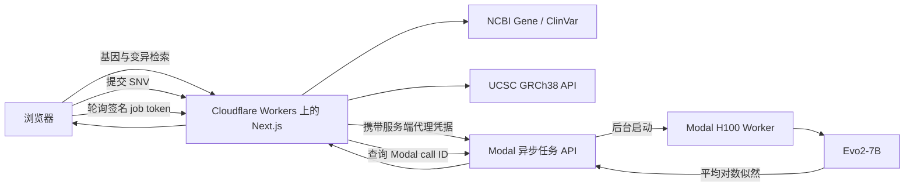
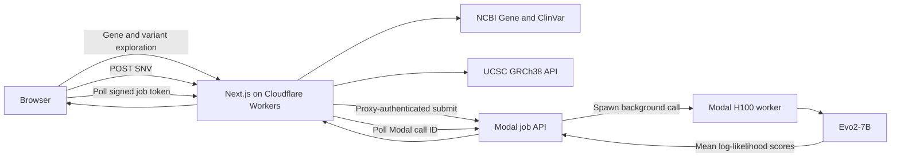

# GeneLM Evo2

**大阪大学 GenAI Lab 个人项目成果｜基于 GRCh38 的全栈基因变异探索与 Evo2-7B 推理系统**

[](https://jarvis-ai.work/)
[](https://doi.org/10.1038/s41586-026-10176-5)
[](https://github.com/ArcInstitute/evo2)
[](LICENSE)

**Project website / 项目网址:** [https://jarvis-ai.work/](https://jarvis-ai.work/)

[中文](#中文) · [English](#english)

> **仅限科研与工程演示。** GeneLM Evo2 输出 DNA 语言模型对参考序列与突变
> 序列的似然差异，不提供临床诊断、致病性分类、校准概率或医疗建议。
>
> **Research use only.** GeneLM Evo2 reports DNA language-model likelihood
> differences. It does not provide a clinical diagnosis, pathogenicity
> classification, calibrated probability, or medical recommendation.

---

## 中文

### 项目概述

GeneLM Evo2 是作者在**大阪大学 GenAI Lab 的研究与学习环境中完成的个人项目
成果**。项目围绕生物基础模型的实际落地，将人类基因检索、参考基因组序列、
ClinVar 变异记录和预训练 **Evo2-7B** DNA 基础模型连接成一套可在线使用、可
测试、可部署的全栈基因变异探索系统。

在线项目：[https://jarvis-ai.work/](https://jarvis-ai.work/)

Cloudflare Worker：
[genelm-evo2.jarviszhang-ai.workers.dev](https://genelm-evo2.jarviszhang-ai.workers.dev/)

本项目的产品设计、数据接口整合、前后端实现、GPU 推理服务、云端部署、安全
边界和自动化测试均由本仓库作者负责。它用于呈现个人在生成式 AI、生物信息学
与云端模型工程交叉方向上的完整实践，**不代表大阪大学或 GenAI Lab 官方发布
的软件、研究结论或临床工具**。

### 研究背景与项目定位

基因变异分析通常需要在多个数据源和坐标体系之间切换：基因信息来自 NCBI，
临床变异记录来自 ClinVar，参考碱基来自特定版本的参考基因组，而 DNA 语言模型
又要求长度固定、方向一致的序列输入。任何坐标偏移、链方向混淆或参考碱基错误，
都会使模型比较失去意义。

GeneLM Evo2 的重点不是简单包装一个模型 API，而是建立一条边界清晰的端到端
分析链路：

1. 使用 **NCBI Gene** 检索人类基因并获取标准元数据；
2. 根据 GRCh38 基因区间从 **ClinVar** 获取已收录的变异记录；
3. 使用 **UCSC Genome Browser API** 获取 `hg38` 参考序列；
4. 将公共 1-based 坐标转换为 UCSC 0-based half-open 区间；
5. 对反向链基因执行等位基因互补，统一到 GRCh38 正向链；
6. 构造长度严格为 8,192 bp 的 reference/alternate 配对上下文；
7. 通过 Cloudflare 安全代理，将异步任务提交到 Modal H100 上的 Evo2-7B；
8. 在浏览器中展示模型似然差异，并与 ClinVar 临床注释明确分离。

### Evo 2 与 Nature 论文

Evo 2 是 Brixi 等人在 Nature 正刊论文 **《Genome modelling and design
across all domains of life with Evo 2》** 中发布的开放生物基础模型。论文于
2026 年 3 月 4 日在线发表，介绍了跨生命域基因组建模，以及遗传变异影响预测、
模型可解释性和生物序列生成等应用。

本仓库**不声称参与 Evo 2 的模型研发，也不声称复现 Nature 论文中的完整训练
过程或基准结果**。本项目的个人工作成果是将官方发布的预训练 `evo2_7b`
checkpoint 工程化为一个具有真实数据链路、GPU 推理、安全代理、测试和线上界面
的完整应用。

- Nature 论文：[doi:10.1038/s41586-026-10176-5](https://doi.org/10.1038/s41586-026-10176-5)
- Evo 2 官方仓库：[ArcInstitute/evo2](https://github.com/ArcInstitute/evo2)
- 本项目固定的 Evo 2 源码版本：`27f32da50d08501b5cb12e7a55f663e2ec794e0f`
- 仓库内保存的 PDF 为上述 Nature 论文，仅用于项目背景阅读与引用

### 核心功能

- 按基因符号或名称搜索 NCBI 人类基因，并支持可分享的基因详情 URL。
- 展示基因名称、类型、染色体位置、GRCh38 区间和外部数据库链接。
- 交互式浏览最多 10,000 bp 的 UCSC `hg38` 参考序列。
- 获取选定基因区间中的 ClinVar 变异及其临床意义、变异类型和记录链接。
- 从 ClinVar 记录中识别可解析的 SNV，并明确标记当前不支持的 insertion、
  deletion 和其他 indel。
- 支持直接点击参考序列中的碱基，选择替代碱基并提交自定义 SNV 分析。
- 将转录本方向的等位基因标准化到 GRCh38 正向链，包括反向链互补转换。
- 在推理前校验请求中的 reference allele 是否与 UCSC 返回的 GRCh38 碱基一致。
- 输出参考/突变序列的逐 token 平均对数似然及 alt-minus-ref 差值。
- 通过异步 job token 展示排队、冷启动、运行完成与错误状态。

### 系统架构



浏览器不会获得 Modal endpoint、proxy token ID、proxy secret 或原始 Modal
function-call ID。外部数据请求、输入校验、任务签名和错误规范化均由服务端完成。

### 一次变异分析如何完成

以一个 GRCh38 SNV 为例，系统会执行以下步骤：

1. 接收染色体、1-based 位置、reference allele 和 alternate allele；
2. 规范化染色体名称，并拒绝非 `A/C/G/T` 或 reference 与 alternate 相同的请求；
3. 将位置换算为 UCSC API 所需的 0-based 区间并获取局部参考序列；
4. 校验变异中心的真实参考碱基，防止 assembly 或方向错误；
5. 从中心向两侧截取并补齐 8,192 bp reference context；
6. 只替换中心目标碱基，生成长度完全一致的 alternate context；
7. 分别计算两条序列的 token log-likelihood，并对有效 token 求均值；
8. 返回两条序列的分数与 `alternate_score - reference_score`。

这种设计保证 reference 与 alternate 除目标 SNV 外完全一致，从而将比较限定在单
碱基改变带来的模型似然变化上。

### 如何理解 Evo2 分数

系统返回的核心差值为：

```text
delta_likelihood = alternate_mean_log_likelihood - reference_mean_log_likelihood
```

- `delta_likelihood < 0`：在当前 8,192 bp 上下文中，模型认为 alternate 序列的
  平均似然低于 reference 序列。
- `delta_likelihood > 0`：模型对 alternate 序列给出的平均似然更高。
- 数值大小取决于模型、上下文和归一化方式，不能直接当作致病概率。

负值不等于“致病”，正值也不等于“良性”。ClinVar 标签来自 ClinVar 提交与审核
体系，Evo2 分数来自 DNA 语言模型，两者在界面中只做并列展示，不互相替代。

### 关键工程设计

- **严格坐标契约：** 公共接口使用 1-based inclusive 坐标，UCSC 使用
  0-based half-open 区间，所有转换集中在可单元测试的纯函数中。
- **链方向处理：** 对负链转录本执行等位基因互补，避免把 transcript-level
  `G>C` 与 genomic forward-strand `C>G` 错判为方向相反。
- **参考碱基验证：** reference allele 与 GRCh38 不一致时拒绝推理，避免对错误
  assembly、错误位置或错误链方向计算一个看似正常的分数。
- **配对上下文：** reference 与 alternate 输入均固定为 8,192 bp，只在目标位置
  存在一个碱基差异。
- **异步 GPU 任务：** Cloudflare 快速提交任务，Modal 后台完成 H100 冷启动和
  推理，浏览器通过签名的不透明 token 轮询，避免维持超长 HTTP 连接。
- **安全推理边界：** Modal URL 与代理凭据仅存在于 Cloudflare Worker secrets，
  不通过 `NEXT_PUBLIC_*` 暴露给客户端。
- **资源与成本控制：** 匿名分析请求受 Cloudflare Rate Limiting 保护；Modal
  最多扩缩到一台 H100，并在空闲后 scale to zero。
- **可复现模型镜像：** CUDA、PyTorch、Transformer Engine、FlashAttention、
  Evo2 依赖和源码 revision 被显式固定。
- **失败可解释：** 外部数据库错误、无效变异、参考碱基不匹配、任务仍在运行和
  GPU 推理失败会转换为明确的 API 状态，而不是向用户暴露原始服务错误。

### 个人项目成果范围

本项目在大阪大学 GenAI Lab 的研究学习背景下完成，个人实现范围包括：

- 设计从 NCBI、ClinVar、UCSC 到 Evo2 的端到端数据与推理流程；
- 实现 Next.js/TypeScript 前端、基因详情页、序列浏览与变异交互；
- 实现 Cloudflare Worker 服务端代理、Zod 数据契约、限流和签名任务 token；
- 实现 Modal Python 后端、H100 模型加载、异步任务与推理结果接口；
- 拆分并测试坐标转换、序列窗口、等位基因替换和分数归一化逻辑；
- 完成 Cloudflare 与 Modal 的生产部署、密钥隔离和 scale-to-zero 配置；
- 建立前后端 CI，覆盖格式、Lint、类型、单元测试和生产构建。

该范围强调的是对开放模型和公共生物数据库的系统集成、验证与产品化能力，不将
Evo 2 原始模型、Nature 论文成果或 ClinVar 数据归为个人原创成果。

### 当前科学与产品范围

| 维度       | 当前支持                                              |
| ---------- | ----------------------------------------------------- |
| 物种       | 人类                                                  |
| 参考基因组 | GRCh38 / UCSC `hg38`                                  |
| 变异类型   | 单个基因组 SNV：`A`、`C`、`G`、`T`                    |
| 公共坐标   | 1-based inclusive                                     |
| 模型       | 预训练 `evo2_7b`                                      |
| 模型上下文 | 8,192 bp                                              |
| 输出       | reference/alternate 平均对数似然与 alt-minus-ref 差值 |
| 临床标签   | 仅展示 ClinVar 原始注释，不由模型生成                 |
| 目标用途   | 科研探索、模型工程和全栈系统演示                      |

### 技术栈

| 层级     | 技术                                                     |
| -------- | -------------------------------------------------------- |
| 前端     | Next.js 16、React 19、TypeScript、Tailwind CSS、Radix UI |
| 数据契约 | Zod、Pydantic v2                                         |
| 生物数据 | NCBI Gene、ClinVar、UCSC Genome Browser API              |
| 模型服务 | Modal、NVIDIA H100、CUDA 12.8、PyTorch 2.7、Evo2-7B      |
| 边缘部署 | Cloudflare Workers、OpenNext、Wrangler、Rate Limiting    |
| 质量保障 | Vitest、ESLint、TypeScript、Pytest、GitHub Actions       |

### 仓库结构

```text
GeneLM-Evo2/
├── genelm-frontend/
│   ├── src/app/api/analyze-variant/route.ts  # Cloudflare 推理代理
│   ├── src/components/                       # 基因、序列与 SNV 交互界面
│   ├── src/utils/                            # 外部 API 与类型化数据契约
│   ├── open-next.config.ts
│   └── wrangler.jsonc
├── genelm-backend/
│   ├── main.py                               # Modal 任务 API 与 H100 Worker
│   ├── variant_core.py                       # 坐标和评分纯逻辑
│   └── tests/
├── .github/workflows/ci.yml
├── LICENSE
└── README.md
```

### 本地开发

前端要求 Node.js 22 与 npm：

```bash
cd genelm-frontend
npm ci
npm run dev
```

未配置 Modal 时，基因搜索、序列浏览和 ClinVar 查询仍可本地运行。如需本地调用
已部署的推理服务，将 `.dev.vars.example` 中的变量名复制到被 Git 忽略的
`.env.local`，并填写 Modal endpoint 与 proxy token。

后端在本机使用 Conda 环境 `Biotech_ev2`：

```bash
cd genelm-backend
conda activate Biotech_ev2
env PYTHONNOUSERSITE=1 python -m pip install -r requirements-dev.txt
env PYTHONNOUSERSITE=1 python -m pytest -q
```

### 自动化验证

```bash
cd genelm-frontend
npm run check
npm run build:cloudflare

cd ../genelm-backend
env PYTHONNOUSERSITE=1 conda run -n Biotech_ev2 python -m pytest -q
env PYTHONNOUSERSITE=1 conda run -n Biotech_ev2 python -m py_compile main.py variant_core.py
```

当前版本已经验证：

- 前端 **10 项测试**通过；
- 后端 **8 项测试**通过；
- Prettier、ESLint 和 TypeScript 检查通过；
- Next.js 与 Cloudflare/OpenNext 生产构建通过；
- GitHub Actions 的 frontend/backend jobs 通过；
- 已完成真实 Modal H100 Evo2-7B 推理 smoke test。

单元测试不下载 Evo2 权重，也不将本机结果表述为 H100 性能测试。

### 部署方式

部署带身份验证的 Modal 服务：

```bash
cd genelm-backend
conda activate Biotech_ev2
env PYTHONNOUSERSITE=1 python -m pip install -r requirements.txt
modal setup
modal deploy main.py
```

将 Modal endpoint 与 proxy token 保存为 Cloudflare Worker secrets：

```bash
cd ../genelm-frontend
npx wrangler secret put MODAL_ANALYZE_URL
npx wrangler secret put MODAL_PROXY_KEY
npx wrangler secret put MODAL_PROXY_SECRET
npm run deploy
```

这些值不能使用 `NEXT_PUBLIC_*` 前缀，也不能提交到 Git 仓库。

### 已验证的推理示例

对 GRCh38 SNV `chr17:43119628 T>G`，已部署的 Evo2-7B H100 服务返回：

```json
{
  "model": "evo2_7b",
  "context_length": 8192,
  "reference": "T",
  "alternate": "G",
  "reference_score": -0.8358864784240723,
  "alternate_score": -0.8358675837516785,
  "delta_likelihood": 0.000018894672393798828
}
```

该结果只表示指定上下文下的模型似然比较，不是临床解释。

### 使用限制

- 当前只对人类 GRCh38 单核苷酸变异进行模型评分。
- 本系统不是临床决策支持工具，不能用于诊断、治疗或遗传咨询。
- ClinVar 临床意义来自 ClinVar，不是 Evo2 输出的预测标签。
- Evo2 likelihood delta 不是校准后的致病概率，也没有固定的临床阈值。
- 尚未建立持久化论文基准评估流程，因此不声称复现 Nature 论文中的 AUROC、
  速度、吞吐量或成本结果。
- 项目集成预训练 Evo2-7B，没有从零训练或微调 Evo 2。
- 外部数据库内容可能更新，线上结果还取决于 NCBI、ClinVar、UCSC、Modal 和
  Cloudflare 的可用性。

---

## English

### Overview

GeneLM Evo2 is a personal full-stack research and engineering project for
exploring human genes and scoring single-nucleotide variants (SNVs) with the
pretrained **Evo2-7B** DNA foundation model.

The application connects four layers into one reproducible workflow:

1. **NCBI Gene** search and gene metadata;
2. **ClinVar** variant records and clinical annotations;
3. **UCSC GRCh38** reference-sequence retrieval with explicit coordinate
   conversion;
4. authenticated **Evo2-7B inference on Modal H100**, proxied through a
   Cloudflare Worker.

The live interface is available at
[jarvis-ai.work](https://jarvis-ai.work/). The current Cloudflare Worker build
is also reachable at
[genelm-evo2.jarviszhang-ai.workers.dev](https://genelm-evo2.jarviszhang-ai.workers.dev/).

### Model and Nature publication

Evo 2 is an open biological foundation-model family introduced by Brixi et al.
in the Nature article **“Genome modelling and design across all domains of life
with Evo 2”**, published online on 4 March 2026.

The paper describes Evo 2 models trained on genomic sequences spanning all
domains of life, with applications in variant-effect prediction,
interpretability, and biological sequence generation. This repository **does
not claim authorship of Evo 2 or reproduction of the Nature benchmarks**. It
integrates the released pretrained `evo2_7b` checkpoint into a secure,
testable, end-to-end genomic analysis product.

- Nature paper: [doi:10.1038/s41586-026-10176-5](https://doi.org/10.1038/s41586-026-10176-5)
- Official model repository: [ArcInstitute/evo2](https://github.com/ArcInstitute/evo2)
- Pinned source revision: `27f32da50d08501b5cb12e7a55f663e2ec794e0f`

### What the application does

- Searches human genes by symbol or name and supports direct gene URLs.
- Displays NCBI gene metadata, genomic coordinates, and external references.
- Loads up to 10,000 bp of UCSC `hg38` sequence in an interactive viewer.
- Retrieves ClinVar records within the selected GRCh38 gene interval.
- Restricts Evo2 scoring to resolvable SNVs and clearly labels unsupported
  insertions, deletions, and other indels.
- Normalizes transcript alleles to the GRCh38 forward strand, including
  reverse-strand complementation.
- Builds matched 8,192 bp reference and alternate contexts around the variant.
- Returns mean per-token log-likelihoods and
  `alternate_score - reference_score`.
- Keeps all outputs explicitly separate from ClinVar clinical significance.

### Engineering highlights

- **Explicit coordinate contract:** the public API accepts 1-based inclusive
  positions; UCSC receives 0-based half-open intervals; Evo2 always receives
  exactly 8,192 bases.
- **Reference validation:** a request is rejected if its expected reference
  allele does not match the fetched GRCh38 base.
- **Asynchronous GPU jobs:** Cloudflare submits a short authenticated request,
  Modal runs Evo2 in the background, and the browser polls with a signed opaque
  job token. This supports scale-to-zero H100 inference without holding one
  long HTTP request open during cold starts.
- **Protected inference boundary:** Modal URL and proxy credentials remain
  server-side Cloudflare secrets and never reach the browser.
- **Cost controls:** anonymous analysis submissions are rate-limited and the
  Modal class scales to at most one H100 container.
- **Reproducible model image:** CUDA, PyTorch, Transformer Engine,
  FlashAttention, Evo2 dependencies, and the Evo2 Git revision are pinned.
- **Honest scientific presentation:** no unsupported AUROC, pathogenicity
  accuracy, throughput, or clinical-performance claim is made.

### Architecture



The browser never receives the Modal endpoint, proxy token ID, proxy secret,
or raw Modal function-call ID.

### Supported scientific contract

| Dimension          | Current support                                                  |
| ------------------ | ---------------------------------------------------------------- |
| Species            | Human                                                            |
| Reference assembly | GRCh38 / UCSC `hg38`                                             |
| Variant type       | One genomic SNV: `A`, `C`, `G`, or `T`                           |
| Public coordinates | 1-based inclusive                                                |
| Model              | Pretrained `evo2_7b`                                             |
| Scoring context    | 8,192 bp                                                         |
| Output             | Mean reference/alternate log-likelihoods and alt-minus-ref delta |
| Intended use       | Research and software-engineering demonstration only             |

### Technology stack

| Layer           | Technologies                                             |
| --------------- | -------------------------------------------------------- |
| Frontend        | Next.js 16, React 19, TypeScript, Tailwind CSS, Radix UI |
| Data contracts  | Zod, Pydantic v2                                         |
| Genomic data    | NCBI Gene, ClinVar, UCSC Genome Browser API              |
| Model serving   | Modal, NVIDIA H100, CUDA 12.8, PyTorch 2.7, Evo2-7B      |
| Edge deployment | Cloudflare Workers, OpenNext, Wrangler, Rate Limiting    |
| Verification    | Vitest, ESLint, TypeScript, Pytest, GitHub Actions       |

### Repository layout

```text
GeneLM-Evo2/
├── genelm-frontend/
│   ├── src/app/api/analyze-variant/route.ts  # Cloudflare inference proxy
│   ├── src/components/                       # gene, sequence, and SNV UI
│   ├── src/utils/                            # typed external API contracts
│   ├── open-next.config.ts
│   └── wrangler.jsonc
├── genelm-backend/
│   ├── main.py                               # Modal job API + H100 worker
│   ├── variant_core.py                       # pure coordinate/scoring logic
│   └── tests/
├── .github/workflows/ci.yml
└── README.md
```

### Local development

#### Frontend

Requires Node.js 22 and npm.

```bash
cd genelm-frontend
npm ci
npm run dev
```

Gene search, sequence exploration, and ClinVar browsing work without Modal.
For local inference, copy the variable names from `.dev.vars.example` into an
ignored `.env.local` file and provide the deployed Modal endpoint and proxy
token.

#### Backend tests on this Mac

The local development environment is the Conda environment `Biotech_ev2`:

```bash
cd genelm-backend
conda activate Biotech_ev2
env PYTHONNOUSERSITE=1 python -m pip install -r requirements-dev.txt
env PYTHONNOUSERSITE=1 python -m pytest -q
```

The unit suite validates coordinate conversion, chromosome normalization,
reference checking, exact context length, mutation direction, mean score
reduction, and asynchronous job request validation. It does not download model
weights or claim local GPU performance.

### Quality gates

```bash
cd genelm-frontend
npm run check
npm run build:cloudflare

cd ../genelm-backend
env PYTHONNOUSERSITE=1 conda run -n Biotech_ev2 python -m pytest -q
env PYTHONNOUSERSITE=1 conda run -n Biotech_ev2 python -m py_compile main.py variant_core.py
```

The verified local result for the current revision is **10 frontend tests and
8 backend tests passing**, plus a successful Cloudflare production build and a
real Modal H100 inference smoke test.

### Deployment

Deploy the authenticated Modal service:

```bash
cd genelm-backend
conda activate Biotech_ev2
env PYTHONNOUSERSITE=1 python -m pip install -r requirements.txt
modal setup
modal deploy main.py
```

Store the endpoint and Modal proxy token as Cloudflare Worker secrets:

```bash
cd ../genelm-frontend
npx wrangler secret put MODAL_ANALYZE_URL
npx wrangler secret put MODAL_PROXY_KEY
npx wrangler secret put MODAL_PROXY_SECRET
npm run deploy
```

Never expose these values through `NEXT_PUBLIC_*` variables or commit them to
Git.

### Verified inference example

For the GRCh38 SNV `chr17:43119628 T>G`, the deployed Evo2-7B H100 smoke test
returned:

```json
{
  "model": "evo2_7b",
  "context_length": 8192,
  "reference": "T",
  "alternate": "G",
  "reference_score": -0.8358864784240723,
  "alternate_score": -0.8358675837516785,
  "delta_likelihood": 0.000018894672393798828
}
```

This is a model likelihood comparison, not a clinical interpretation.

### Resume-ready description

> Built and deployed a full-stack GRCh38 variant-analysis platform integrating
> NCBI Gene, ClinVar, UCSC reference sequences, and pretrained Evo2-7B inference
> on Modal H100 GPUs through an authenticated Cloudflare Worker.

> Implemented strand-aware SNV normalization, fixed 8,192 bp
> reference/alternate scoring, signed asynchronous GPU jobs, schema validation,
> rate limiting, automated tests, CI, and scale-to-zero deployment.

### Limitations

- Only human GRCh38 SNVs are currently scored.
- The system is not a clinical decision-support tool.
- ClinVar significance labels come from ClinVar, not Evo2.
- No paper benchmark, AUROC, latency, throughput, or cost result is claimed as
  a result of this repository without a persisted evaluation protocol.
- The project integrates a pretrained model; it does not train Evo2 from
  scratch.

---

## Citation and attribution / 引用与归属

If you use the underlying Evo 2 model, cite the original publication:

> Brixi, G. et al. Genome modelling and design across all domains of life with
> Evo 2. _Nature_ 652 (2026).
> [https://doi.org/10.1038/s41586-026-10176-5](https://doi.org/10.1038/s41586-026-10176-5)

Additional data sources:

- [NCBI Gene](https://www.ncbi.nlm.nih.gov/gene/)
- [ClinVar](https://www.ncbi.nlm.nih.gov/clinvar/)
- [UCSC Genome Browser API](https://api.genome.ucsc.edu/)
- [Cloudflare Workers](https://developers.cloudflare.com/workers/)
- [Modal](https://modal.com/)

## License

This project is released under the [MIT License](LICENSE).
